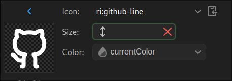

# SPFYUI

## Why spfyui ?

- _**SpfyUI** solves the *problem* of *limited icon sets* and *bloated packages* in React projects by letting you dynamically add icons or UI components from various providers as needed, avoiding unnecessary codebase clutter._
- ### Key Benefits
  - Dynamic Integration
  - Reduced Bloat
  - Unified Interface

### Preview


## How to use ?

-- Install spfyui globally.

```sh
npm i spfyui -g

```

-- Go to your react project and initialize spfyui

```sh
spfyui init

```

-- Now you are ready to go

---

#### you can download any svg icon from general category : [Icons/general](https://icon-sets.iconify.design/?category=General)

[](https://icon-sets.iconify.design/?category=General)

### Commands

- Add icon. `add | a`

```sh
spfyui add ri:github-line #<provider>:<iconname>
```

- List icons.

```sh
spfyui list # icons installed in current project.
```

```sh
spfyui list <provider> # icons installed from specefic provider.
```

```sh
spfyui list -g #All icons
```

- Remove icon `rm || remove`

```sh
spfyui rm ri:github-line
```

---

Hooray you are all set now you can create a react project and use spfyui.

_Example:_
-- `spfyui init` This sets up necessary utils files and path to icon dir inside src/assets
-- you can download any svg icon from general category : [Icons/general](https://icon-sets.iconify.design/?category=General)
-- `spfyui add ri:github-line`

## TODOs

- [x] Add `add` Feature: Implemented the functionality to add icons or components.
- [x] extend `add` Feature: Support to svg icons with multiple path data.
- [x] Add `init` Command: Set up the initial project configuration.
- [x] Add `rm` Feature: Implement functionality to remove icons or components.
- [x] Add Listing Commands:
  - [x] `list`: List all installed icons in the current project.
  - [x] `list <povider>`: List all installed icons by provider.
  - [x] `list -g`: List all installed icons globally.
- [ ] Add support to emojies.
- [ ] Add Component Support: Extend functionality to support UI components
